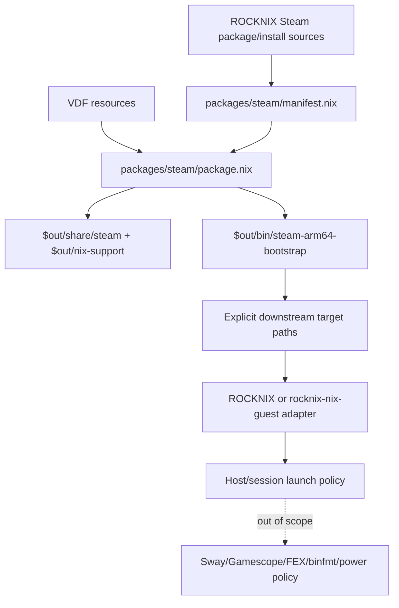

# Add Guest-Native Steam Package Helpers

## Summary

Add a first Steam entry to `nix-sm8550` aimed at guest-native Steam. The package encodes the ROCKNIX Steam ARM64 contract, ships static VDF/resource material, provides env-driven helpers to seed mutable ARM64 Steam client/runtime state, and exposes a `steam-guest-native` preflight/exec helper. It still leaves guest nix-ld/FHS policy, FEX rootfs, binfmt, Sway/Gamescope, and per-game policy to downstream guest/ROCKNIX integration.

---

## Problem Frame

ROCKNIX already has a working Steam ARM64 setup, but it is spread across a package recipe, mutable install script, and host launch scripts. `nix-sm8550` needs a Steam package entry that moves the reusable ARM64 client/runtime bootstrap and launcher preflight toward guest-native execution without regressing the repo's package-only boundary. The package should make the remaining guest runtime requirements explicit instead of silently falling back to host Steam.

---

## Requirements

- R1. Expose a `steam` package entry from `flake.nix` without changing the existing `default = cemu` behavior.
- R2. Preserve `nix-sm8550`'s package-only boundary: no ROCKNIX host launch policy, no hardcoded `/storage` layout, no systemd/Sway/Gamescope orchestration in the package contract.
- R3. Capture the ROCKNIX Steam ARM64 bootstrap contract in package-local metadata and resources so downstream integrations can consume it consistently.
- R4. Provide a deterministic Nix build artifact; mutable downloads and target filesystem writes may happen only via an explicit runtime bootstrap helper, never during derivation build.
- R5. Target guest-native Steam explicitly: provide a helper that preflights and execs the ARM64 Steam client from guest-owned mutable state, while failing clearly until the guest supplies nix-ld or an FHS dynamic-linker strategy.
- R6. Add static/package checks that protect the Steam boundary from accidental integration creep.
- R7. Document that host Steam display bridging was only validation/source material; the package target is guest-native Steam and must not fall back to host Steam.

---

## Scope Boundaries

- Do not hide the NixOS `stub-ld`/FHS problem; the package helper must preflight it and downstream guest modules must solve it.
- Do not move ROCKNIX `/storage` compatibility layout, FEX rootfs management, binfmt toggling, power policy, Sway dispatch, or Gamescope launch geometry into `nix-sm8550`.
- Do not package Balatro-specific launch behavior, Proton experiment settings, or per-game compatibility data.
- Do not change `default` away from Cemu.
- Do not fetch Valve's moving ARM64 client/runtime URLs during Nix build in v1; pinned fixed-output Valve client/runtime seed artifacts are deferred to follow-up work.

### Deferred to Follow-Up Work

- Guest nix-ld/FHS module: separate `rocknix-nix-guest` work to export `NIX_LD` and the needed dynamic libraries into the Sway/user session.
- ROCKNIX/guest launch adapter for host Steam into guest Sway: belongs in `rocknix-nix-guest` or ROCKNIX integration, not this package-only change.
- Pinned Valve ARM64 client/runtime seed artifacts: separate follow-up plan after the bootstrap metadata shape is reviewed and exact hashes are captured.

---

## Context & Research

### Relevant Code and Patterns

- `flake.nix` currently exposes `cemu`, `default`, and `cemu-rocknix-package` for both `x86_64-linux` and `aarch64-linux`.
- `packages/cemu/package.nix` is the established package pattern: import data from `manifest.nix`, build/copy package-owned artifacts under `$out`, and emit small evidence files under `$out/nix-support`.
- `packages/cemu/manifest.nix` is the precedent for a data-only contract file documenting ROCKNIX source facts and intentional Nix deltas.
- `scripts/static-checks.sh` is the cheap boundary gate; it should grow Steam-specific assertions rather than relying on live hardware validation.
- ROCKNIX source reference: `projects/ROCKNIX/packages/emulators/standalone/steam/package.mk` installs Steam launcher deb contents and static VDF resources.
- ROCKNIX source reference: `projects/ROCKNIX/packages/virtual/emulators/sources/Install Steam.sh` performs mutable ARM64 runtime/client download, FEX setup, Steam library linking, and first-launch preparation.
- ROCKNIX source reference: `projects/ROCKNIX/packages/emulators/standalone/steam/scripts/start_steam.sh` owns host launch policy and must remain downstream, not copied as package logic.

### Institutional Learnings

- ROCKNIX learning `docs/solutions/best-practices/manual-steam-game-launching-rocknix-arm64-2026-05-04.md`: the reliable Balatro path required Steam desktop context, SteamLinuxRuntime_sniper, Proton 10.0, nested Gamescope SDL/X11, and Sway session context.
- ROCKNIX learning `docs/solutions/runtime-errors/steam-desktop-ui-arm64-manifest-spinner-rocknix-2026-05-04.md`: desktop Steam can spin forever unless the ARM64 client manifest is recreated from installed metadata before launch.
- ROCKNIX learning `docs/solutions/performance-issues/rocknix-layer14-cemu-performance-audit-2026-05-09.md`: package repos should capture package-owned runtime facts while leaving host/session/storage policy in adapters.
- ROCKNIX learning `docs/solutions/developer-experience/nix-layer-7-app-ui-experiments-rocknix-2026-05-05.md`: graphical app integrations should stay narrow, reversible, and manual until launch/cleanup paths are boring.

### External References

- Valve ARM64 Steam client/runtime surfaces appear to be moving beta endpoints, including `steam_client_publicbeta_linuxarm64` and SteamRT ARM64 runtime tarballs. Treat them as runtime bootstrap facts for v1; Nix-fetched fixed-output seed artifacts are out of scope for this plan.
- NixOS Steam packaging commonly relies on FHS-compatible environments for generic Steam. That reinforces deferring a direct guest-native launcher until `nix-sm8550` intentionally tackles FHS/stub-ld behavior.

---

## Key Technical Decisions

- Start with a bootstrap/resources package, not a runnable Steam launcher: this matches the user's selected contract and avoids turning a known guest-native failure into a confusing package output.
- Keep `default = cemu`: Steam is additive and should not disrupt the existing Cemu-centered package surface.
- Use a package-local `manifest.nix`: Steam has more moving external facts than Cemu, so the source/URL/resource/downstream-boundary contract needs to be explicit and reviewable.
- Ship static VDF resources in the package output: these are immutable package resources from ROCKNIX and fit the package boundary.
- Make the bootstrap helper required for v1, but keep it env-driven and non-launching: it requires explicit target configuration and supports a dry-run/plan mode for safe verification.
- Omit `meta.mainProgram = "steam"`; if a main program is declared, it must point at the bootstrap helper and documentation must state that it is not a Steam client launcher.
- Add static checks for forbidden integration behavior in executable package logic: the package must not import ROCKNIX Steam launch scripts, call host session managers, embed display-server orchestration, hardcode ROCKNIX storage paths, or perform network fetches during build. Documentation may name downstream-owned surfaces only as boundaries, not as copy-paste launch recipes.

---

## Open Questions

### Resolved During Planning

- Should v1 be bootstrap/resources only or a runnable Steam package? Resolved: bootstrap/resources package first.
- Should host-to-guest Sway display bridging live in `nix-sm8550`? Resolved: no; it is downstream integration policy.

### Deferred to Implementation

- Exact fixed-output hashes for Valve client/runtime seed artifacts: deferred to the follow-up seed-artifact plan, not implementation of this v1 package.
- Exact bootstrap helper flag spelling: implementation should choose names that are clear and shellcheck-friendly while preserving the env-driven contract below.
- Whether the package should expose a compatibility alias such as `steam-rocknix-package`: implement only if a downstream consumer is ready to use it; otherwise keep the surface minimal.

---

## Output Structure

```text
packages/steam/
  README.md
  manifest.nix
  package.nix
  resources/
    compatibilitytool.vdf
    registry.vdf
    toolmanifest.vdf
  scripts/
    steam-arm64-bootstrap
    steam-arm64-seed
    steam-guest-native
```

---

## High-Level Technical Design

> *This illustrates the intended approach and is directional guidance for review, not implementation specification. The implementing agent should treat it as context, not code to reproduce.*



The Nix derivation should build immutable package resources and metadata. The bootstrap helper, if invoked by a downstream adapter or operator, may prepare a mutable Steam home outside the Nix store, but it must make that mutability explicit and avoid embedding ROCKNIX-specific session orchestration.

---

## Implementation Units

### U1. Add Steam package manifest and resources

**Goal:** Create the package-local source of truth for Steam's ROCKNIX-derived bootstrap contract and copy static Steam VDF resources into the repo.

**Requirements:** R2, R3, R4, R7

**Dependencies:** Pinned ROCKNIX source reference for the Steam resources (local checkout or upstream commit), recorded in `manifest.nix`.

**Files:**
- Create: `packages/steam/manifest.nix`
- Create: `packages/steam/resources/compatibilitytool.vdf`
- Create: `packages/steam/resources/toolmanifest.vdf`
- Create: `packages/steam/resources/registry.vdf`
- Test: `scripts/static-checks.sh`

**Approach:**
- Model `manifest.nix` after `packages/cemu/manifest.nix`, but keep it data-only.
- Record ROCKNIX source paths, Steam launcher version, ARM64 runtime/client endpoint facts, resource file list, supported v1 contract, unsupported guest-native launcher note, and the ROCKNIX commit or source snapshot used to copy resources.
- Copy only immutable VDF/resource files from a pinned ROCKNIX source reference. If implementation uses a local sibling ROCKNIX checkout, it must still record the commit in `manifest.nix`; if unavailable locally, fetch/read the same files from the recorded upstream commit before copying.
- Do not copy ROCKNIX launch scripts or mutable install scripts as active package logic.

**Patterns to follow:**
- `packages/cemu/manifest.nix`
- `projects/ROCKNIX/packages/emulators/standalone/steam/resources/compatibilitytool.vdf`
- `projects/ROCKNIX/packages/emulators/standalone/steam/resources/toolmanifest.vdf`
- `projects/ROCKNIX/packages/emulators/standalone/steam/resources/registry.vdf`

**Test scenarios:**
- Happy path: resource files copied into `packages/steam/resources/` match the recorded ROCKNIX source snapshot.
- Happy path: `manifest.nix` records the source commit/paths, v1 package contract, and downstream-owned launch/storage surfaces.
- Error path: missing source provenance in `manifest.nix` is caught by the U3 static-check suite.

**Verification:**
- Steam manifest and resource files are present, reviewable, and contain no host/session launch policy.

---

### U2. Build the Steam bootstrap/resources derivation

**Goal:** Add `packages/steam/package.nix` that produces a deterministic Nix store output containing Steam resources, bootstrap metadata, evidence, and an explicit generic bootstrap helper.

**Requirements:** R2, R3, R4, R5

**Dependencies:** U1

**Files:**
- Create: `packages/steam/package.nix`
- Create: `packages/steam/scripts/steam-arm64-bootstrap`
- Test: `scripts/static-checks.sh`

**Approach:**
- Use a no-compile derivation shape similar to Cemu's install/evidence posture, but without pretending to build Steam itself.
- Install resources under a package-owned share path and write a Steam evidence manifest under `$out/nix-support`.
- The bootstrap helper should be generic and explicit: target paths come from environment variables such as `STEAM_HOME`, `STEAM_GAMES_ROOT`, and `STEAM_DOT`, mutation happens only when the helper is invoked, and a dry-run/plan mode can verify intended actions without touching disk.
- Allowed helper actions for v1: validate explicit target configuration, create caller-provided target directories, copy package VDF resources, write/update Steam beta/manifest metadata, report required ARM64 runtime/client endpoints, optionally download those moving inputs to caller-provided paths, and use temporary files plus atomic rename for writes.
- Forbidden helper actions for v1: create ROCKNIX compatibility layouts, create Steam library symlinks with baked-in ROCKNIX paths, manage FEX rootfs state, toggle binfmt, start or stop sessions/services, run Gamescope, launch Steam, or launch a game.
- The helper may encode reusable ARM64 client manifest repair logic because that is a Steam bootstrap invariant, but it must not perform host/session launch orchestration.
- Avoid `meta.mainProgram = "steam"`; if a main program is needed, point it at the bootstrap helper and document that it is not a Steam launcher.

**Patterns to follow:**
- `packages/cemu/package.nix` for `$out` layout and evidence files.
- `projects/ROCKNIX/packages/virtual/emulators/sources/Install Steam.sh` for bootstrap facts only; do not copy its storage layout, FEX rootfs setup, first-launch behavior, or session commands into the helper.

**Test scenarios:**
- Happy path: local derivation evaluation/call-package coverage confirms resources would install under `$out/share` and evidence under `$out/nix-support` before flake exposure.
- Happy path: invoking the bootstrap helper in dry-run/plan mode reports intended target paths and required external inputs without writing to the target.
- Error path: invoking the helper without required target configuration exits with a clear diagnostic rather than defaulting to ROCKNIX storage paths.
- Error path: interrupted or failed downloads/writes leave no partially named final files because the helper uses temporary files and atomic rename.
- Error path: the package build does not attempt network access or target filesystem mutation.
- Integration: the evidence file lists the ROCKNIX source contract, the v1 supported contract, and the guest-native unsupported note.

**Verification:**
- The derivation implementation is ready for flake wiring and does not depend on proprietary Valve client/runtime artifacts being fetched by Nix in v1.

---

### U3. Expose Steam in the flake and extend static checks

**Goal:** Make `steam` available as a flake package while protecting the package-only boundary with cheap automated checks.

**Requirements:** R1, R2, R5, R6

**Dependencies:** U2

**Files:**
- Modify: `flake.nix`
- Modify: `scripts/static-checks.sh`
- Test: `scripts/static-checks.sh`

**Approach:**
- Add a `steam = pkgs.callPackage ./packages/steam/package.nix { };` binding inside the existing per-system package set.
- Expose `packages.${system}.steam = steam` while leaving `default = cemu` unchanged.
- Add static checks for flake exposure, package files, resource files, README coverage, evidence strings, source provenance, and forbidden integration behavior.
- Keep compatibility aliases out of v1 unless implementation discovers an immediate downstream consumer.

**Patterns to follow:**
- Existing Cemu exposure and assertions in `flake.nix` and `scripts/static-checks.sh`.

**Test scenarios:**
- Happy path: `scripts/static-checks.sh` passes when `steam` is exposed and resources exist.
- Error path: changing `default` away from `cemu` causes the existing default-package assertion to fail.
- Error path: adding host session commands, display-server orchestration, ROCKNIX launch-script imports, or hardcoded ROCKNIX storage paths to executable Steam package logic causes static checks to fail.
- Error path: adding concrete downstream launch commands or storage-layout recipes to Steam docs causes static checks to fail; docs may state boundaries but not provide copy-paste host/guest launch policy.
- Error path: root README omitting `steam` from the package table after flake exposure causes static checks to fail.
- Integration: `nix flake show` lists `steam` without requiring a live device.
- Integration: building `.#steam` produces resources under `$out/share` and evidence under `$out/nix-support`.

**Verification:**
- The flake exposes `steam` consistently for the repo's supported systems and static checks guard the intended boundary.

---

### U4. Document the Steam package contract and downstream handoff

**Goal:** Update package and root documentation so users understand what `.#steam` is, what it is not, and where ROCKNIX-specific launch work belongs.

**Requirements:** R3, R5, R7

**Dependencies:** U1, U2, U3

**Files:**
- Create: `packages/steam/README.md`
- Modify: `README.md`
- Test: `scripts/static-checks.sh`

**Approach:**
- Add a package README explaining the bootstrap/resources contract, expected downstream responsibilities, and the current validated host/guest split.
- Update the root package table with `steam` while preserving Cemu as default.
- Document known unsupported paths: guest-native direct launch, Balatro-specific launch policy, and ROCKNIX storage/session mutation.
- Include concise validation guidance focused on package evaluation/build and static checks, not hardware launch instructions.

**Patterns to follow:**
- `packages/cemu/README.md`
- Root `README.md` package-boundary section.

**Test scenarios:**
- Happy path: docs state `steam` is a bootstrap/resources package and do not claim that `nix run .#steam` launches Steam desktop.
- Error path: U3 static checks fail if root README omits `steam` from the package table after flake exposure.
- Integration: docs clearly route host/guest display adapters to downstream repos rather than `nix-sm8550`, without embedding concrete launch commands.

**Verification:**
- A reader can tell how to build the package, what files it provides, and why Steam launch policy is intentionally out of scope.

---

## System-Wide Impact

- **Interaction graph:** `flake.nix` gains a new package output; downstream ROCKNIX/guest code can consume package resources but remains responsible for mutable setup and launch.
- **Error propagation:** Package build failures should be deterministic Nix/resource errors; runtime bootstrap failures should be explicit helper diagnostics, not silent writes or confusing `stub-ld` crashes.
- **State lifecycle risks:** The Nix store output is immutable; mutable Steam state must stay outside `$out` and be opt-in through a helper or downstream adapter.
- **API surface parity:** `cemu` and `default` remain unchanged; `steam` is additive.
- **Integration coverage:** Static checks and flake/build validation prove package shape; hardware validation of Steam/Balatro remains downstream.
- **Unchanged invariants:** `nix-sm8550` stays package-only; ROCKNIX remains owner of host session policy, `/storage`, FEX rootfs, binfmt, Sway, Gamescope, and power controls.

---

## Risks & Dependencies

| Risk | Mitigation |
|------|------------|
| Steam package name implies a runnable client | README, omitted/diagnostic main program, and static checks must state bootstrap/resources contract clearly. |
| Valve ARM64 endpoints move | Keep moving URLs as manifest/bootstrap facts in v1; pinning seed artifacts is deferred to a separate plan. |
| Proprietary Steam payload policy is misunderstood | Avoid Nix-fetched Valve client/runtime artifacts in v1; mark the bootstrap/resource package license for the included ROCKNIX metadata/resources and document that downstream Steam payloads remain proprietary. |
| ROCKNIX integration logic creeps into package repo | Static checks forbid host/session commands and hardcoded ROCKNIX storage paths in executable package logic and forbid copy-paste launch recipes in docs. |
| Downstream consumers need a runnable launcher immediately | Defer to a downstream adapter plan; do not hide host-to-guest bridge logic inside `nix-sm8550`. |
| Bootstrap helper accidentally mutates operator state | Require explicit target configuration and provide dry-run/plan mode before writes. |

---

## Documentation / Operational Notes

- Root docs should call this a Steam bootstrap/resources package, not a full Steam runtime.
- Package docs should include the current validated split: host Steam/Gamescope/Proton processes can display into guest Sway, but those processes are not guest-owned.
- Do not fetch proprietary Valve client/runtime artifacts by Nix in this v1 implementation; document that pinned seed artifacts require a follow-up plan and that downstream mutable Steam payloads remain proprietary.
- If downstream ROCKNIX adopts the package, document that change in the downstream repo rather than expanding this package plan.

---

## Sources & References

- `README.md`
- `flake.nix`
- `scripts/static-checks.sh`
- `packages/cemu/package.nix`
- `packages/cemu/manifest.nix`
- `packages/cemu/README.md`
- ROCKNIX source reference: `projects/ROCKNIX/packages/emulators/standalone/steam/package.mk`
- ROCKNIX source reference: `projects/ROCKNIX/packages/virtual/emulators/sources/Install Steam.sh`
- ROCKNIX source reference: `projects/ROCKNIX/packages/emulators/standalone/steam/scripts/start_steam.sh`
- ROCKNIX learning: `docs/solutions/best-practices/manual-steam-game-launching-rocknix-arm64-2026-05-04.md`
- ROCKNIX learning: `docs/solutions/runtime-errors/steam-desktop-ui-arm64-manifest-spinner-rocknix-2026-05-04.md`
